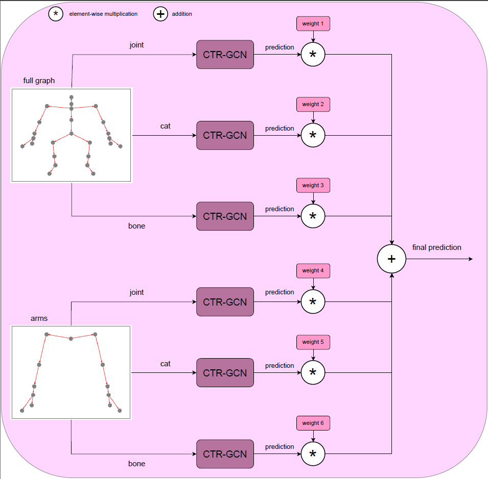

# Improving-skeleton-based-action-recognition-using-part-aware-graphs-in-a-multi-stream-fusion-context

## Architecture of our proposed method

<p align="center">
   
</p>
<p align="center">
   <b>Figure 2:</b> Block diagram of the proposed weighted fusion pipeline using the best
performing combination of part-aware graphs.
</p>

# Preparation
### Install torchlight
Follow the installation process of [CTR-GCN](https://github.com/Uason-Chen/CTR-GCN)

### Download datasets.

#### There are 2 datasets to download:

- NTU RGB+D 60 Skeleton
- NTU RGB+D 120 Skeleton
- 
#### NTU RGB+D 60 and 120

1. Request dataset here: https://rose1.ntu.edu.sg/dataset/actionRecognition
2. Download the skeleton-only datasets:
   1. `nturgbd_skeletons_s001_to_s017.zip` (NTU RGB+D 60)
   2. `nturgbd_skeletons_s018_to_s032.zip` (NTU RGB+D 120)
   3. Extract above files to `./data/nturgbd_raw`


### Data Processing

#### Directory Structure

Put downloaded data into the following directory structure:

```
- data/
  - NW-UCLA/
    - all_sqe
      ... # raw data of NW-UCLA
  - ntu/
  - ntu120/
  - nturgbd_raw/
    - nturgb+d_skeletons/     # from `nturgbd_skeletons_s001_to_s017.zip`
      ...
    - nturgb+d_skeletons120/  # from `nturgbd_skeletons_s018_to_s032.zip`
      ...
```

#### Generating Data

- Generate NTU RGB+D 60 or NTU RGB+D 120 dataset:

```
 cd ./data/ntu # or cd ./data/ntu120
 # Get skeleton of each performer
 python get_raw_skes_data.py
 # Remove the bad skeleton 
 python get_raw_denoised_data.py
 # Transform the skeleton to the center of the first frame
 python seq_transformation.py
```


# Training & Testing

### Training

To train the NTU RGB+D 60 dataset for the cross-subject category for the cat modality and for the 'full_graph' open the default.yaml config file in 'config\nturgbd-cross-subject' and do the following changes:
1. train_feeder_args->cat: True
2. test_feeder_args->cat: True
3. val_feeder_args->cat: True
4. model_args->in_channels: 6 (use 'in_channels: 3' for the joint and bone modalities)
5. model_args->graph_args->part_aware_graph: 'full_graph' (other options include: 'arms', 'legs' 'lhrl' and 'rhll')
6. run the command below:

```
python main.py --config config/nturgbd-cross-subject/default.yaml --work-dir work_dir/ntu/csub/cat_full_graph --device 0
```

### Testing

To test the NTU RGB+D 60 dataset for the cross-subject category for the cat modality and for the 'full_graph':

```
python main.py --config work_dir/ntu/csub/cat_full_graph/config.yaml --phase test --weights work_dir/ntu/csub/cat_full_graph/xxx.pt --work-dir work_dir/ntu/csub/cat_full_graph
```

### Ensemble

To ensemble the results from two (2) previous trainings and testings use:

```
python ensemble.py --dataset ntu/xsub --mod1 work_dir/ntu/csub/cat_full_graph --mod2 work_dir/ntu/csub/bone_full_graph
```

A maximum of six (6) streams is supported.

## Acknowledgements

This repo is based on [2s-AGCN](https://github.com/lshiwjx/2s-AGCN) and [CTR-GCN](https://github.com/Uason-Chen/CTR-GCN).

Thanks to the original authors for their work!

## References

```bibtex
@ARTICLE{10288432,
  author={Tsakiris, Zois and Tsochatzidis, Lazaros and Pratikakis, Ioannis},
  journal={IEEE Access}, 
  title={Improving Skeleton-Based Action Recognition Using Part-Aware Graphs in a Multi-Stream Fusion Context}, 
  year={2023},
  volume={11},
  number={},
  pages={117308-117320},
  keywords={Joints;Bones;Topology;Network topology;Convolutional neural networks;Recurrent neural networks;Graph neural networks;Human activity recognition;Skeleton;Motion control;Graph convolutional networks;skeleton-based action recognition;part-aware graphs},
  doi={10.1109/ACCESS.2023.3325750}
}


